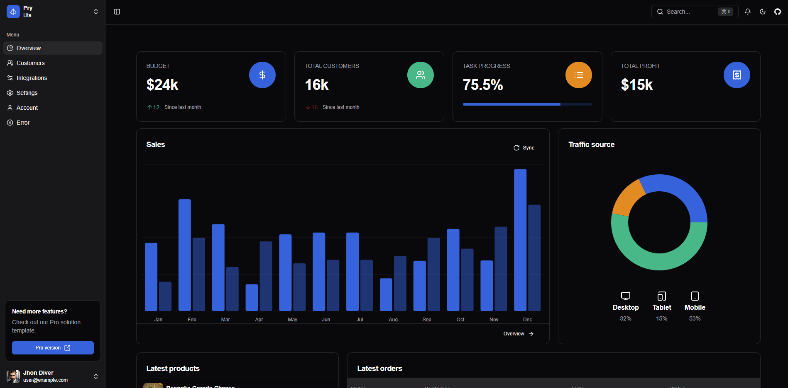

### [🖥️ Live Preview](https://pry-vite-lite.vercel.app/)

## Overview

This is a starter template using the following stack:

- Framework - [React Vite (App Router)](https://vite.dev/)
- Language - [TypeScript](https://www.typescriptlang.org)
- Styling - [Tailwind CSS](https://tailwindcss.com)
- Components - [Shadcn UI](https://ui.shadcn.com/)
- Deployment - [Vercel](https://vercel.com/docs/concepts/next.js/overview)
- Analytics - [Vercel Analytics](https://vercel.com/analytics)

This template uses the new React vite. This includes support for enhanced layouts, colocation of components, and styles.

[](https://pry-vite-lite.vercel.app/)


## Pages

- [Dashboard](https://pry-vite-lite.vercel.app/dashboard)
- [Customers](https://pry-vite-lite.vercel.app/dashboard/customers)
- [Integrations](https://pry-vite-lite.vercel.app/dashboard/integrations)
- [Settings](https://pry-vite-lite.vercel.app/dashboard/settings)
- [Account](https://pry-vite-lite.vercel.app/dashboard/account)
- [Sign In](https://pry-vite-lite.vercel.app/sign-in)
- [Sign Up](https://pry-vite-lite.vercel.app/sign-up)

## Quick start

- Clone the repo: `git clone https://github.com/fiqryx/pry-vite-lite.git`
- Make sure your Node.js and npm versions are up to date
- Install dependencies: `npm install` or `yarn`
- Start the server: `npm run dev` or `yarn dev`
- Open browser: `http://localhost:3001`

## File Structure

Within the download you'll find the following directories and files:

```
...
├── public
└── src
	├── assets
	├── components
	├── config
	├── hooks
	├── lib
	├── types
	├── stores
	└── app
		├── main.tsx
		├── middleware.tsx
		├── not-found.tsx
		├── route.tsx
		├── (app)
		└── (auth)
```

## Pro Version
Upgrade to the Pro version and unlock a host of advanced features to supercharge your app development. With the Pro version, you gain access to tools and integrations that make creating awesome applications faster and easier!

| Feature                        | Lite 			| Pro   		|
|--------------------------------|------------------|------------------|
| **External Auth Integrations** | ❌ 		 		| ✅ 			|
| **Database Client (Supabase)** | ❌ 		 		| ✅ 			|
| **Support Pages**              | Limited 			 | Complete feature set	|
| **Internationalization (i18n)**| ❌ 				| ✅ 			|
| **Mapbox Integration**         | ❌ 				| ✅ 			|
| **Theme Color Support**        | ❌ 				| ✅ 			|
| **Resizable Sidebar**          | ❌ 				| ✅ 			|
| **Other Features**             | Limited 			 | Complete feature set |

<!-- ✨ Level up your experience—at no extra cost! -->

### [](https://pry-nextjs-pro.vercel.app/)

## Reporting Issues:

- [Github Issues Page](https://github.com/fiqryx/pry-vite-lite/issues)


## License

- Licensed under [MIT](https://github.com/fiqryx/pry-vite-lite/blob/main/LICENSE)
